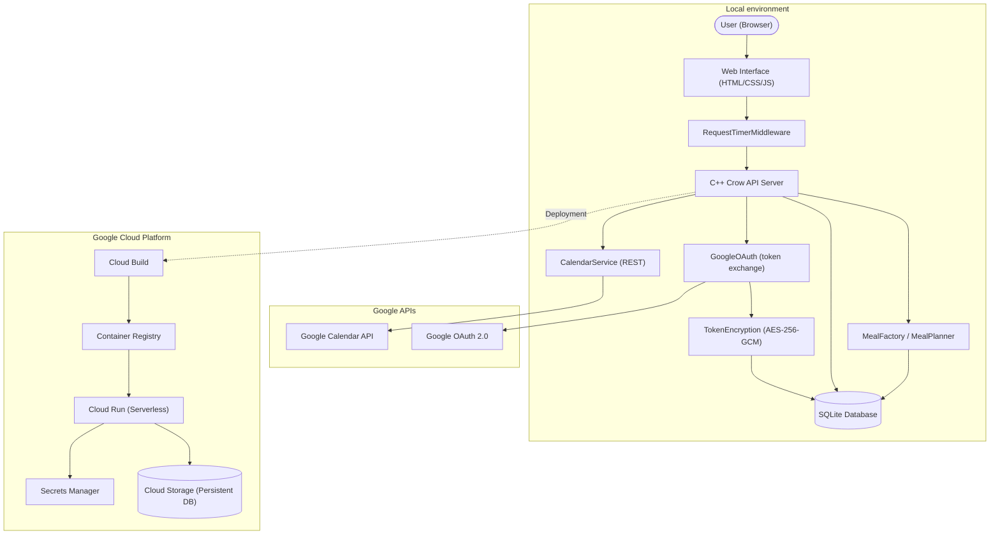

# Meal Prep Application

A C++ based meal preparation and planning application. It allows you to manage recipes, schedule meals for the week, and automatically generate consolidated grocery lists which can be emailed to you.

## Features

- **Store Meals:** Create, read, update, and delete meals and their ingredients in a local SQLite database.
- **Weekly Schedule:** Plan your meals for each day of the week with drag-and-drop scheduling.
- **Grocery List Generation:** Automatically consolidate ingredients from selected meals into a single, unified grocery list, returned via the API and optionally saved as a Google Calendar order reminder.
- **Google Calendar Integration:** Sync your weekly meal plan to Google Calendar and create grocery order reminders.
- **Web Interface:** A responsive single-page application for visual meal planning.
- **REST API:** A robust API backing the web interface for meal management, planning, and calendar sync.

## Prerequisites

This project uses a fully Dockerized development environment to ensure consistency. You will need:
- Docker
- Docker Compose
- `make`

## Quickstart

All development commands are wrapped in the `Makefile` and are executed inside the Docker container automatically.

1. **Create your local config**
   ```bash
   cp meal_prep.conf.json.example meal_prep.conf.json
   ```
   Edit `meal_prep.conf.json` to set your email address and paths to your credential files in `~/.meal_prep/`. The server will start without this file, but email and Google Calendar features will not work.

2. **Build the Environment**
   ```bash
   make build
   ```
   This command starts the background containers and compiles the C++ codebase inside the container.

3. **Start the API Server**
   ```bash
   make start
   ```
   This will start the Meal Prep API server on port 8080. You can then access the web interface at [http://localhost:8080](http://localhost:8080).

4. **Stop the Environment**
   ```bash
   make stop
   ```
   Brings down the Docker containers and cleans up the active environment.

5. **Clean Build Files**
   ```bash
   make clean
   ```
   Removes the generated build directories both natively and within the container.

## Testing

To run the automated test suite:
```bash
make test
```
This command compiles the tests and runs them using `ctest` inside the Docker environment.

Additional quality targets:

| Command | Description |
| :--- | :--- |
| `make lint` | Run clang-tidy and clang-format checks via `lintenator.sh`. |
| `make lint-fix` | Same as `lint` but auto-applies fixes. |
| `make asan` | Build and test with AddressSanitizer + UBSan. |
| `make tsan` | Build and test with ThreadSanitizer. |
| `make coverage` | Build with coverage instrumentation and print a summary. |
| `make cppcheck` | Run static analysis with cppcheck. |

## Architecture

The Meal Prep application follows a modular architecture consisting of a C++ backend, a web-based frontend, and a cloud-native deployment strategy.



### Components
- **Backend (C++):** Built using the Crow web framework with `RequestTimerMiddleware` logging request durations on all routes. Handles RESTful requests, manages the SQLite database, and integrates with Google Calendar.
- **Frontend:** A responsive single-page application with drag-and-drop scheduling, served statically by the C++ backend.
- **Database:** SQLite stores recipes, schedules, and encrypted OAuth tokens. In production, the database file is persisted on Google Cloud Storage via FUSE mount.
- **Google Integration:** OAuth 2.0 Authorization Code Flow for Google Calendar access. Tokens are stored encrypted with AES-256-GCM via `TokenEncryption` (requires `MEAL_PREP_TOKEN_KEY` env var).
- **MealFactory / MealPlanner:** `MealFactory` constructs `Meal` objects from DB rows; `MealPlanner` consolidates ingredients across a plan.
- **Infrastructure:** Dockerized for local development and deployed to Google Cloud Run for scalability.

## Workflow

The project follows a streamlined development-to-deployment workflow:

1.  **Local Development:**
    - Use `make build` to set up the Docker environment and compile the code.
    - Run `make start` to launch the API and Web UI locally on [http://localhost:8080](http://localhost:8080).
2.  **Testing:**
    - Execute `make test` to run the suite of automated C++ unit tests.
3.  **Deployment:**
    - Changes are pushed to production via `gcloud builds submit`, which triggers the configuration in `cloudbuild.yaml`.
    - The application is containerized and deployed to Google Cloud Run.
    - Persistence is maintained by syncing the SQLite `meals.db` with GCS before and after service execution.
    - To verify the deployment status and get the live URL, run: `gcloud run services describe meal-prep --region us-central1`

## Project Structure

- `src/`: Contains all C++ source code and header files for the core backend, database management, and API routes.
- `static/`: Contains the frontend assets (HTML, CSS, JS) served by the web application.
- `tests/`: Contains the automated C++ unit tests.
- `docs/`: Contains additional project documentation:
    - [API Reference](docs/API.md)
    - [GCP Commands](docs/GCP_COMMANDS.md)
    - [Docker Commands](docs/DOCKER_COMMANDS.md)
    - [DB Dump Job](docs/DB_DUMP_JOB.md)
- `Dockerfile` & `docker-compose.yml`: Definitions for the Docker development environment.
- `Makefile`: Provides shortcuts for building, starting, and testing the project.
