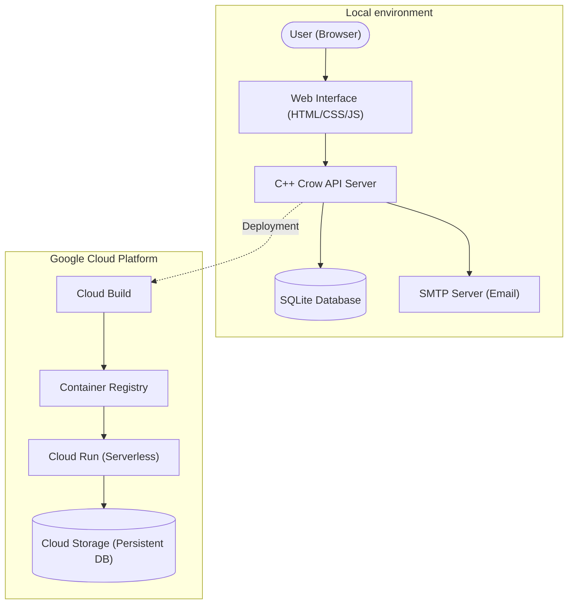

# Meal Prep Application

A C++ based meal preparation and planning application. It allows you to manage recipes, schedule meals for the week, and automatically generate consolidated grocery lists which can be emailed to you.

## Features

- **Store Meals:** Create, read, update, and delete meals and their ingredients in a local SQLite database.
- **Weekly Schedule:** Plan your meals for each day of the week.
- **Grocery List Generation:** Automatically consolidate ingredients from selected meals into a single, unified grocery list.
- **Email Notifications:** Send the final grocery list directly to your email using SMTP.
- **Web Interface:** A simple interactive web UI to plan your meals visually.
- **REST API:** A robust API backing the web interface for meal management and planning.

## Prerequisites

This project uses a fully Dockerized development environment to ensure consistency. You will need:
- Docker
- Docker Compose
- `make`

## Quickstart

All development commands are wrapped in the `Makefile` and are executed inside the Docker container automatically.

1. **Build the Environment**
   ```bash
   make build
   ```
   This command starts the background containers and compiles the C++ codebase inside the container.

2. **Start the API Server**
   ```bash
   make start
   ```
   This will start the Meal Prep API server on port 8080. You can then access the web interface at [http://localhost:8080](http://localhost:8080).

3. **Stop the Environment**
   ```bash
   make stop
   ```
   Brings down the Docker containers and cleans up the active environment.

4. **Clean Build Files**
   ```bash
   make clean
   ```
   Removes the generated build directories both natively and within the container.

## Testing

To run the automated test suite:
```bash
make test
```
This command compiles the tests and runs them using `ctest` inside the Docker environment.

## Architecture

The Meal Prep application follows a modular architecture consisting of a C++ backend, a web-based frontend, and a cloud-native deployment strategy.



### Components
- **Backend (C++):** Built using the Crow web framework. It handles RESTful requests, manages the SQLite database, and interacts with SMTP for emails.
- **Frontend:** A simple, responsive single-page application served statically by the C++ backend.
- **Database:** SQLite is used for local storage of recipes and schedules. In production, this is synced with Google Cloud Storage.
- **Infrastructure:** Dockerized for local development and deployed to Google Cloud Run for scalability.

## Workflow

The project follows a streamlined development-to-deployment workflow:

1.  **Local Development:**
    - Use `make build` to set up the Docker environment and compile the code.
    - Run `make start` to launch the API and Web UI locally on [http://localhost:8080](http://localhost:8080).
2.  **Testing:**
    - Execute `make test` to run the suite of automated C++ unit tests.
3.  **Deployment:**
    - Changes are pushed to production via `gcloud builds submit`, which triggers the configuration in `cloudbuild.yaml`.
    - The application is containerized and deployed to Google Cloud Run.
    - Persistence is maintained by syncing the SQLite `meals.db` with GCS before and after service execution.

## Project Structure

- `src/`: Contains all C++ source code and header files for the core backend, database management, and API routes.
- `static/`: Contains the frontend assets (HTML, CSS, JS) served by the web application.
- `tests/`: Contains the automated C++ unit tests.
- `docs/`: Contains additional project documentation:
    - [API Reference](docs/API.md)
    - [GCP Commands](docs/GCP_COMMANDS.md)
    - [Docker Commands](docs/DOCKER_COMMANDS.md)
- `Dockerfile` & `docker-compose.yml`: Definitions for the Docker development environment.
- `Makefile`: Provides shortcuts for building, starting, and testing the project.
